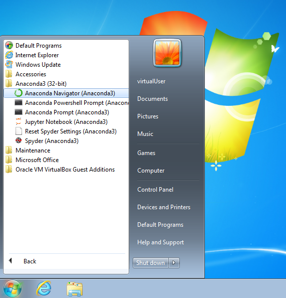
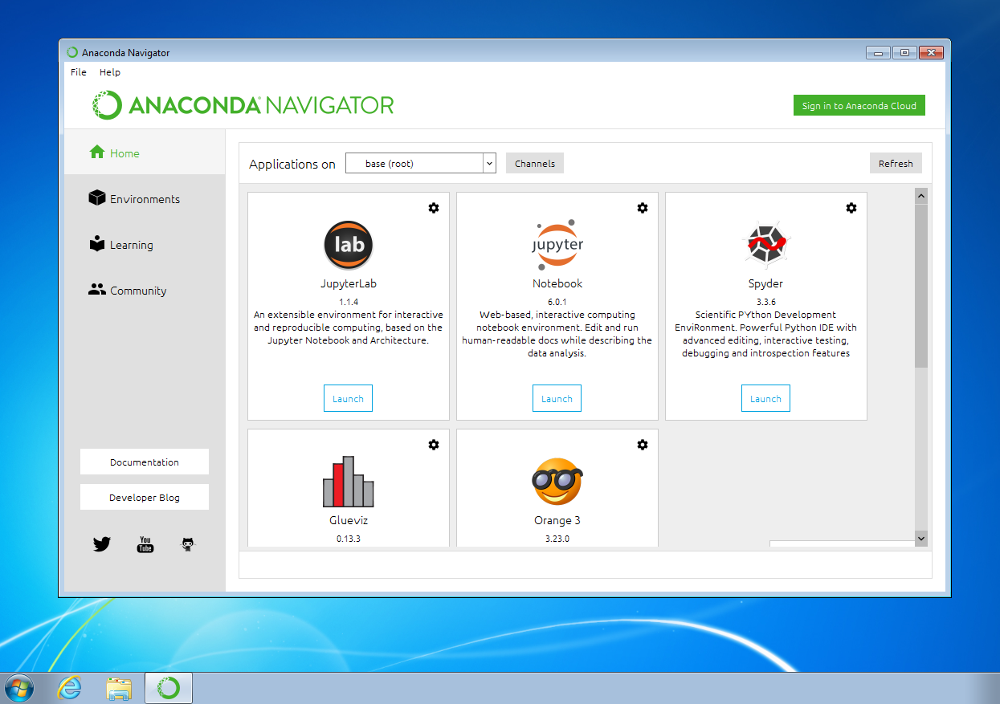
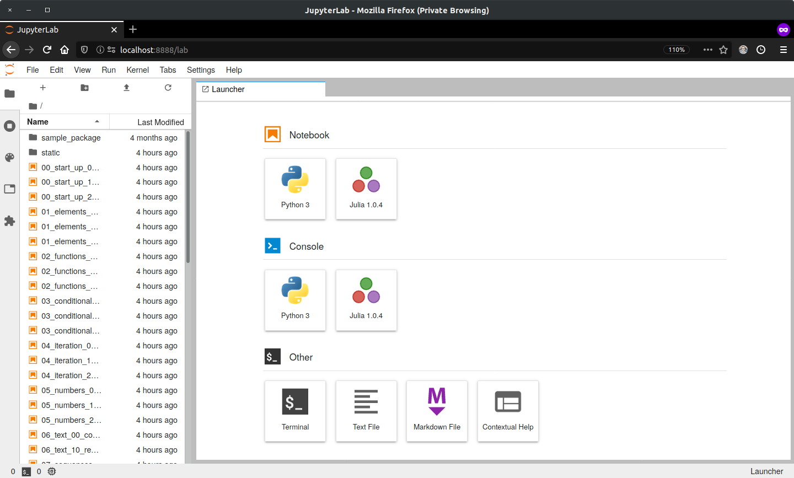

# An Introduction to Python and Programming

The purpose of this repository is to serve as an interactive book for a
thorough introductory course on programming in the
**[Python ](https://www.python.org/)**
language.

The course's **main goal** is to **prepare** the student for **further
studies** in the "field" of **data science**.

The chapters are laid out in [Jupyter notebooks ](https://jupyter-notebook.readthedocs.io/en/stable/)
which are a de-facto standard for exchanging code and analyses among data
science professionals and researchers.
They can be viewed in a web browser either statically on [nbviewer ](https://nbviewer.jupyter.org/github/webartifex/intro-to-python/tree/master/)
or interactively (i.e., you can execute the code) on [mybinder ](https://mybinder.org/v2/gh/webartifex/intro-to-python/master?urlpath=lab):

- *Chapter 0*: Introduction
  ([content ](https://nbviewer.jupyter.org/github/webartifex/intro-to-python/blob/master/00_intro_00_content.ipynb)
   
   
   | [review ](https://nbviewer.jupyter.org/github/webartifex/intro-to-python/blob/master/00_intro_01_review.ipynb)
   
   | [exercises ](https://nbviewer.jupyter.org/github/webartifex/intro-to-python/blob/master/00_intro_02_exercises.ipynb)
   )
- **Part A: Expressing Logic**
  - *Chapter 1*: Elements of a Program
    ([content ](https://nbviewer.jupyter.org/github/webartifex/intro-to-python/blob/master/01_elements_00_content.ipynb)
     
     
     | [review ](https://nbviewer.jupyter.org/github/webartifex/intro-to-python/blob/master/01_elements_01_review.ipynb)
     
     | [exercises ](https://nbviewer.jupyter.org/github/webartifex/intro-to-python/blob/master/01_elements_02_exercises.ipynb)
     )
  - *Chapter 2*: Functions & Modularization
    ([content ](https://nbviewer.jupyter.org/github/webartifex/intro-to-python/blob/master/02_functions_00_content.ipynb)
     
     
     | [review ](https://nbviewer.jupyter.org/github/webartifex/intro-to-python/blob/master/02_functions_01_review.ipynb)
     
     | [exercises ](https://nbviewer.jupyter.org/github/webartifex/intro-to-python/blob/master/02_functions_02_exercises.ipynb)
     )
  - *Chapter 3*: Conditionals & Exceptions
    ([content ](https://nbviewer.jupyter.org/github/webartifex/intro-to-python/blob/master/03_conditionals_00_content.ipynb)
     
     
     | [review ](https://nbviewer.jupyter.org/github/webartifex/intro-to-python/blob/master/03_conditionals_01_review.ipynb)
     
     | [exercises ](https://nbviewer.jupyter.org/github/webartifex/intro-to-python/blob/master/03_conditionals_02_exercises.ipynb)
     )
  - *Chapter 4*: Recursion & Looping
    ([content ](https://nbviewer.jupyter.org/github/webartifex/intro-to-python/blob/master/04_iteration_00_content.ipynb)
     
     
     | [review ](https://nbviewer.jupyter.org/github/webartifex/intro-to-python/blob/master/04_iteration_01_review.ipynb)
     
     | [exercises 1 ](https://nbviewer.jupyter.org/github/webartifex/intro-to-python/blob/master/04_iteration_02_exercises.ipynb)
     
     | [exercises 2 ](https://nbviewer.jupyter.org/github/webartifex/intro-to-python/blob/master/04_iteration_03_exercises.ipynb)
     )
- **Part B: Managing Data and Memory**
  - *Chapter 5*: Numbers & Bits
    ([content ](https://nbviewer.jupyter.org/github/webartifex/intro-to-python/blob/master/05_numbers_00_content.ipynb)
     
     
     | [review ](https://nbviewer.jupyter.org/github/webartifex/intro-to-python/blob/master/05_numbers_01_review.ipynb)
     
     | [exercises ](https://nbviewer.jupyter.org/github/webartifex/intro-to-python/blob/master/05_numbers_02_exercises.ipynb)
     )
  - *Chapter 6*: Text & Bytes
    ([content ](https://nbviewer.jupyter.org/github/webartifex/intro-to-python/blob/master/06_text_00_content.ipynb)
     
     
     | [review ](https://nbviewer.jupyter.org/github/webartifex/intro-to-python/blob/master/06_text_01_review.ipynb)
     
     | [exercises ](https://nbviewer.jupyter.org/github/webartifex/intro-to-python/blob/master/06_text_02_exercises.ipynb)
     )
  - *Chapter 7*: Sequential Data
    ([content ](https://nbviewer.jupyter.org/github/webartifex/intro-to-python/blob/master/07_sequences_00_content.ipynb)
     
     
     | [review ](https://nbviewer.jupyter.org/github/webartifex/intro-to-python/blob/master/07_sequences_01_review.ipynb)
     
     | [exercises ](https://nbviewer.jupyter.org/github/webartifex/intro-to-python/blob/master/07_sequences_02_exercises.ipynb)
     )
  - *Chapter 8*: Map, Filter, & Reduce
    ([content ](https://nbviewer.jupyter.org/github/webartifex/intro-to-python/blob/master/08_mfr_00_content.ipynb)
     
     
     | [review ](https://nbviewer.jupyter.org/github/webartifex/intro-to-python/blob/master/08_mfr_01_review.ipynb)
     
     | [exercises ](https://nbviewer.jupyter.org/github/webartifex/intro-to-python/blob/master/08_mfr_02_exercises.ipynb)
     )
  - *Chapter 9*: Mappings & Sets
    ([content ](https://nbviewer.jupyter.org/github/webartifex/intro-to-python/blob/master/09_mappings_00_content.ipynb)
     
     
     | [review ](https://nbviewer.jupyter.org/github/webartifex/intro-to-python/blob/master/09_mappings_01_review.ipynb)
     
     | [exercises ](https://nbviewer.jupyter.org/github/webartifex/intro-to-python/blob/master/09_mappings_02_exercises.ipynb)
     )
  - *Chapter 10*: Classes & Instances
    ([content ](https://nbviewer.jupyter.org/github/webartifex/intro-to-python/blob/master/10_classes_00_content.ipynb)
     
     
     | [review ](https://nbviewer.jupyter.org/github/webartifex/intro-to-python/blob/master/10_classes_01_review.ipynb)
     
     | [exercises ](https://nbviewer.jupyter.org/github/webartifex/intro-to-python/blob/master/10_classes_02_exercises.ipynb)
     )

However, it is recommended to **install Python and [Jupyter ](https://jupyter.org)
locally** and run the code in the notebooks on one's own machine in the [JupyterLab ](https://jupyterlab.readthedocs.io/en/stable/)
application.
Precise **installation instructions** are either in [Chapter 0 ](
https://nbviewer.jupyter.org/github/webartifex/intro-to-python/blob/master/00_intro_00_content.ipynb#Installation)
or further below.

### Feedback

Feedback **is highly encouraged** and will be incorporated.
Simply open an issue in the [issues tracker ](https://github.com/webartifex/intro-to-python/issues)
or initiate a [pull request ](https://help.github.com/en/articles/about-pull-requests)
if you are familiar with the concept.
Simple issues that anyone can **help fix** are, for example,
**spelling mistakes** or **broken links**.
If you feel that some topic is missing entirely, you may also mention that.
The materials here are considered a **permanent work-in-progress**.

A "Show HN" post about this course was made on [Hacker News ](https://news.ycombinator.com/item?id=22669084)
and some ideas for improvement were discussed there.

### Videos

Presentations on the chapters are available either via the individual links to
[YouTube ](https://www.youtube.com)
above or this [playlist ](https://www.youtube.com/playlist?list=PL-2JV1G3J10lQ2xokyQowcRJI5jjNfW7f).

### Prerequisites

To be suitable for *total beginners*, there are *no* formal prerequisites.
It is only expected that the student has:

- a *solid* understanding of the **English language**,
- knowledge of **basic mathematics** from high school,
- the ability to **think conceptually** and **reason logically**, and
- the willingness to **invest around 90 - 120 hours on this course**.

## Installation

To follow this course, a working installation of **Python 3.7** or higher is
expected.

A popular and beginner friendly way is to install the [Anaconda Distribution](
https://www.anaconda.com/distribution/) that not only ships Python but comes
pre-packaged with a lot of third-party libraries from the so-called
"scientific stack".
Just go to the [download](https://www.anaconda.com/distribution/#download-section)
section and install the latest version (i.e., *2019-10* with Python 3.7 at the
time of this writing) for your operating system.

Then, among others, you will find an entry "[Anaconda Navigator](https://docs.anaconda.com/anaconda/navigator/)"
in your start menu like below.
Click on it.

A window opens showing you several applications that come with the Anaconda
Distribution.
Now, click on "JupyterLab."

A new tab in your web browser opens with the website being "localhost" and some
number (e.g., 8888).
This is the [JupyterLab ](https://jupyterlab.readthedocs.io/en/stable/)
application that is used to display and run the notebooks mentioned above.
On the left, you see the files and folders in your local user folder.
This file browser works like any other.
In the center, you have several options to launch (i.e., "create") new files.

Next, to download the course's materials as a ZIP file, click on the green
"Clone or download" button on the top right on this website.
Then, unpack the ZIP file into a folder of your choosing, ideally somewhere
within your personal user folder so that the files show up right away in
JupyterLab.

### Alternative Installation (for Instructors)

Python can also be installed in a "pure" way as obtained from its core
development team (i.e., without any third-party packages installed).
However, this may be too "advanced" for a beginner as it involves working
with a [terminal emulator ](https://en.wikipedia.org/wiki/Terminal_emulator),
which looks like the one in the picture below and is used *without* a mouse by
typing commands into it.

Assuming that you already have a working version of Python 3.7 or higher
installed (cf., the official [download page ](https://www.python.org/downloads/)),
the following summarizes the commands to be typed into a terminal emulator to
get the course materials up and running on a local machine without the
Anaconda Distribution.
You are then responsible for understanding the concepts behind them.

First, the [git](https://git-scm.com/) command line tool is a more professional
way of "cloning" the course materials as compared to downloading them in a ZIP
file.

- `git clone https://github.com/webartifex/intro-to-python.git`

This creates a new folder *intro-to-python* with all the materials of this
repository in it.

Inside this folder, it is recommended to create a so-called **virtual
environment** with Python's [venv ](https://docs.python.org/3/library/venv.html)
module.
This must only be done the first time.
A virtual environment is a way of *isolating* the third-party packages
installed by different projects, which is considered a best practice.

- `python -m venv venv`

The second *venv* is the environment's name and by convention often chosen to
be *venv*.
However, it could be another name as well.

From then on, each time you want to resume work, go back into the
*intro-to-python* folder inside your terminal and "activate" the virtual
environment (*venv* is the name chosen before).

- `source venv/bin/activate`

This may change how the terminal's [command prompt ](https://en.wikipedia.org/wiki/Command-line_interface#Command_prompt)
looks.

[poetry](https://poetry.eustace.io/docs/) and [virtualenvwrapper](https://virtualenvwrapper.readthedocs.io/en/latest/)
are popular tools to automate the described management of virtual environments.

After activation for the first time, you must install the project's
**dependencies** (= the third-party packages needed to run the code), most
notably [JupyterLab ](https://pypi.org/project/jupyterlab/) in this project
(the "python -m" is often left out [but should not be](https://snarky.ca/why-you-should-use-python-m-pip/);
if you have poetry installed, you may just type `poetry install` instead).

- `python -m pip install -r requirements.txt`

With everything installed, you can now do the equivalent of clicking the
"JupyterLab" entry in the Anaconda Navigator.

- `jupyter lab`

This opens a new tab in your web browser just as above.

#### Interactive Presentation Mode & Live Coding

The *requirements.txt* file also installs the [nbextensions ](https://github.com/ipython-contrib/jupyter_contrib_nbextensions)
for Jupyter notebooks, the [black ](https://github.com/psf/black)
code formatting tool (incl. the [blackcellmagic ](https://github.com/csurfer/blackcellmagic)
Jupyter extension) and the [RISE ](https://github.com/damianavila/RISE)
Jupyter extension.
With them, the instructor can easily re-format code in a class session and
execute code in presentation mode.

**Note**: Currently, the RISE extension *only* works with the older
notebook command.

- `jupyter notebook` (so, `jupyter lab` may *not* be used).

After installing the dependencies, the instructor must copy the extensions'
JavaScript and CSS files into Jupyter's search directory.

- `jupyter contrib nbextension install --user`

Now, the instructor can enable/disable the various Jupyter notebook
extensions.

**Note**: The extension "Collapsible Headings" may interfere with the
RISE presentation if hotkeys are enabled.

## About the Author

Alexander Hess is a PhD student at the Chair of Logistics Management at the
[WHU - Otto Beisheim School of Management](https://www.whu.edu) where he
conducts research on urban delivery platforms and teaches an introductory
course on Python (cf., [Fall Term 2019](https://vlv.whu.edu/campus/all/event.asp?objgguid=0xE57C2715B01B441AAFD3E79AA05CACCF&from=vvz&gguid=0x6A2B0ED5B2B949E69957A2099E7DE2F1&mode=own&tguid=0x3980A9BBC3BF4A638E977F2DC163F44B&lang=en),
[Spring Term 2020](https://vlv.whu.edu/campus/all/event.asp?objgguid=0x3354F4C108FF4E959CDD692A325D9AFE&from=vvz&gguid=0x262E29795DD742CFBDE72B12B69CEFD6&mode=own&lang=en&tguid=0x2E4A7D1FF3C34AD08FF07685461781C9)).

Connect him on [LinkedIn](https://www.linkedin.com/in/webartifex).
