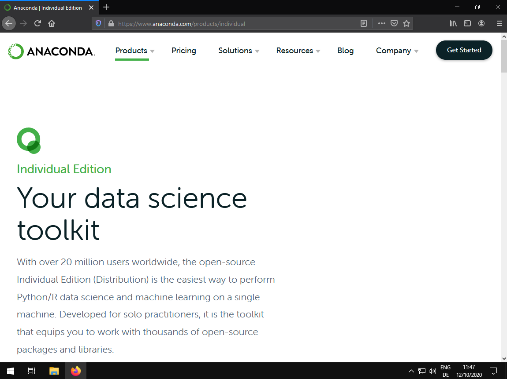
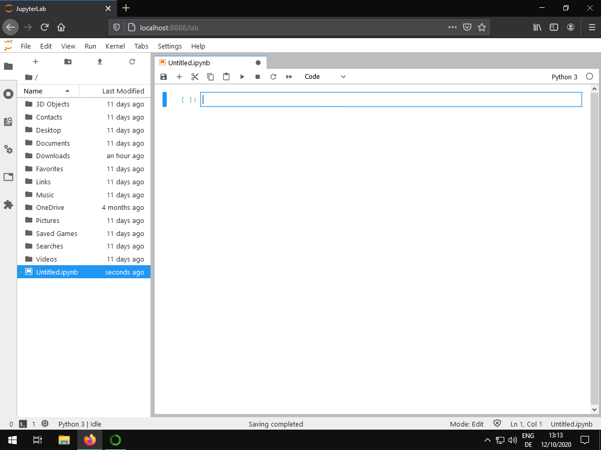
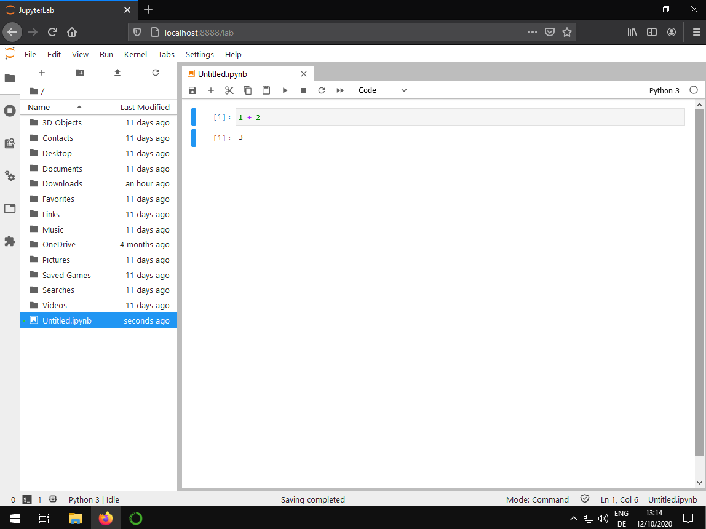
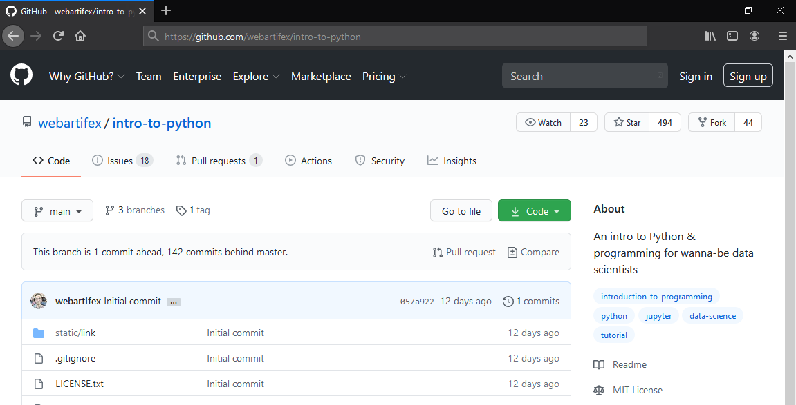
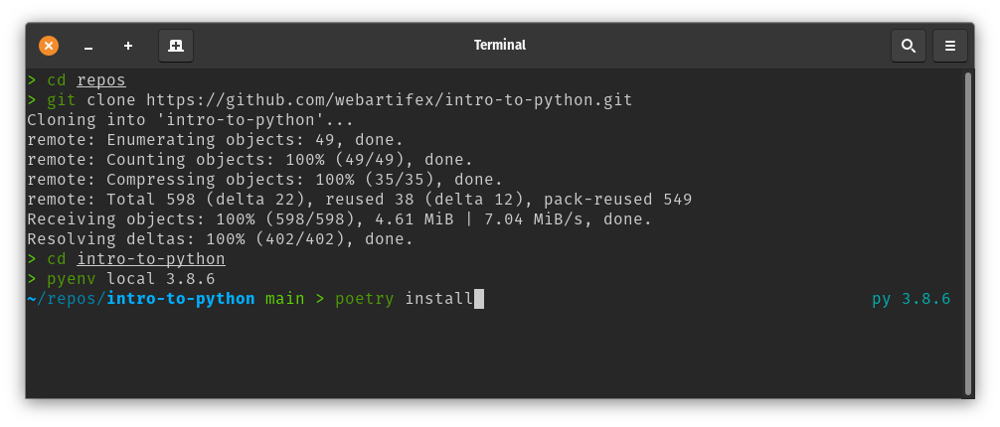
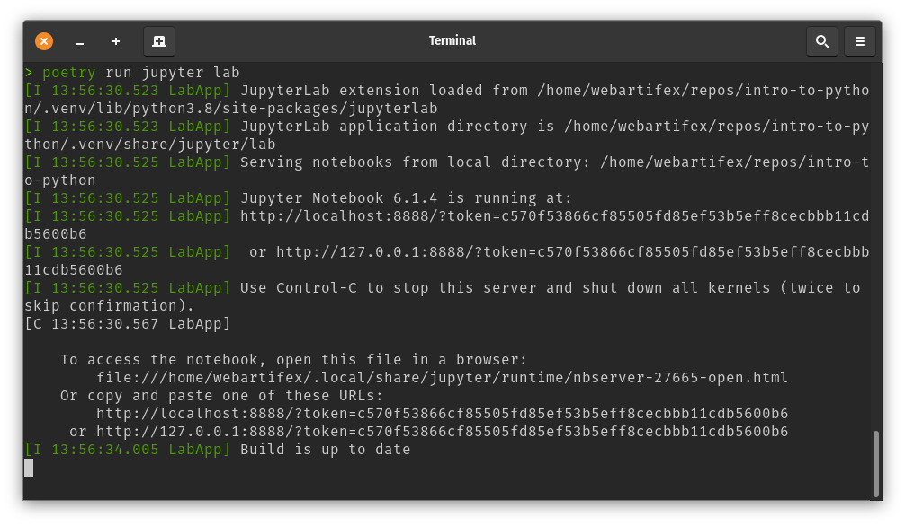
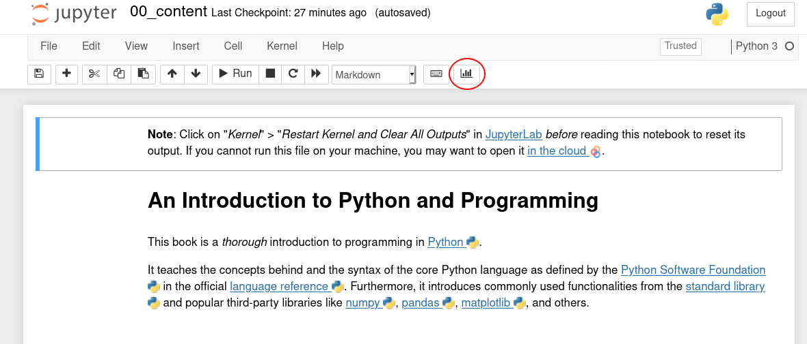

# An Introduction to Python and Programming

This project is a *thorough* introductory course
    in programming with **[Python ](https://www.python.org/)**.

### Table of Contents

The following is a high-level overview of the contents.
For a more *detailed version* with **clickable links**
    see the [CONTENTS.md](CONTENTS.md) file.

- *Chapter 0*: Introduction
- **Part A: Expressing Logic**
  - *Chapter 1*: Elements of a Program
  - *Chapter 2*: Functions & Modularization
  - *Chapter 3*: Conditionals & Exceptions
  - *Chapter 4*: Recursion & Looping
- **Part B: Managing Data and Memory**
  - *Chapter 5*: Numbers & Bits
  - *Chapter 6*: Text & Bytes
  - *Chapter 7*: Sequential Data
  - *Chapter 8*: Map, Filter, & Reduce
  - *Chapter 9*: Mappings & Sets
  - *Chapter 11*: Classes & Instances

#### Videos

Presentations of the chapters are available on this [YouTube playlist ](https://www.youtube.com/playlist?list=PL-2JV1G3J10lQ2xokyQowcRJI5jjNfW7f).
The recordings are about 25 hours long in total
    and were made in spring 2020
    after a corresponding in-class Bachelor course was cancelled due to Corona.

### Objective

The **main goal** is to **prepare** students
    for **further studies** in the "field" of **data science**,
    including but not limited to topics such as:
- algorithms & data structures
- data cleaning & wrangling
- data visualization
- data engineering (incl. SQL databases)
- data mining (incl. web scraping)
- linear algebra
- machine learning (incl. feature generation & deep learning)
- optimization & (meta-)heuristics (incl. management science & operations research)
- statistics & econometrics
- quantitative finance (e.g., option valuation)
- quantitative marketing (e.g., customer segmentation)
- quantitative supply chain management (e.g., forecasting)
- web development (incl. APIs)

### Prerequisites

To be suitable for *beginners*, there are *no* formal prerequisites.
It is only expected that the student has:
- a *solid* understanding of the **English** language,
- knowledge of **basic mathematics** from high school,
- the ability to **think conceptually** and **reason logically**, and
- the willingness to **invest** around **90-120 hours** on this course.

## Getting started

If you are a total beginner,
    follow the instructions in the "Installation" section next.
If you are familiar with
    the [git](https://git-scm.com/)
    and [poetry](https://python-poetry.org/docs/) command-line tools,
    you may want to look at the "Alternative Installation" section further below.

### Installation

To follow this course, an installation of **Python 3.8** or higher is expected.

A popular and beginner friendly way is
    to install the [Anaconda Distribution](https://www.anaconda.com/products/individual)
    that not only ships Python itself
    but also comes pre-packaged with a lot of third-party libraries.

Scroll down to the [download](https://www.anaconda.com/products/individual#Downloads) section
    and install the latest version for your operating system
    (i.e., *2020-07* with Python 3.8 at the time of this writing).

After installation,
    you find an entry "[Anaconda Navigator](https://docs.anaconda.com/anaconda/navigator/)"
    in your start menu.
Click on it.

A window opens giving you several options to start various applications.
In the beginning, we will work mostly with [JupyterLab](https://jupyterlab.readthedocs.io/en/stable/).
Click on "Launch".

A new tab in your web browser opens:
The website is "localhost" and some number (e.g., 8888).

This is the [JupyterLab](https://jupyterlab.readthedocs.io/en/stable/) application
    that is used to display the course materials.
On the left, you see the files and folders on your computer.
This file browser works like any other.
In the center, you see several options to launch (i.e., "create") new files.

To check if your Python installation works,
    double-click on the "Python 3" tile under the "Notebook" section.
That opens a new [Jupyter notebook](https://jupyter-notebook.readthedocs.io/en/stable/)
    named "Untitled.ipynb".

Enter some basic Python in the **code cell**, for example, `1 + 2`.
Then, press the **Enter** key *while* holding down the **Control** key
    (if that does not work, try with the **Shift** key)
    to **execute** the snippet.
The result of the calculation, `3` in the example, shows up below the cell.

After setting up Python,
    click on the green "Code" button on the top right on this website
    to download the course materials.
As a beginner, choosing "Download ZIP" is likely the easiest option.
Then, unpack the ZIP file into a folder of your choice,
    ideally somewhere within your personal user folder
    so that the files show up right away in [JupyterLab](https://jupyterlab.readthedocs.io/en/stable/).

### Alternative Installation (for Instructors)

Python can also be installed in a "pure" way
    obtained directly from its core development team [here](https://www.python.org/downloads/).
Then, it comes *without* any third-party packages,
    which is *not* a problem at all.
Managing third-party packages can be automated to a large degree,
    for example, with tools such as [poetry](https://python-poetry.org/docs/).

However, this may be too "advanced" for a beginner
    as it involves working with a [command-line interface ](https://en.wikipedia.org/wiki/Command-line_interface) (CLI),
    also called a **terminal**,
    which looks like the one below.
It is used *without* a mouse by typing commands into it.
The following instructions assume that
    [git](https://git-scm.com/), [poetry](https://python-poetry.org/docs/),
    and [pyenv](https://github.com/pyenv/pyenv) are installed.

The screenshot above shows how this project can be set up in an alternative way
    with the [zsh](https://en.wikipedia.org/wiki/Z_shell) CLI.

First, [git](https://git-scm.com/) is used
    to **clone** the course materials as a **repository**
    into a new folder called "*intro-to-python*"
    that lives under a "*repos*" folder.

- `git clone https://github.com/webartifex/intro-to-python.git`

The `cd` command is used to "change directories".

In the screenshot, [pyenv](https://github.com/pyenv/pyenv) is used
    to set the project's Python version.
[pyenv](https://github.com/pyenv/pyenv)'s purpose is
    to manage *many* parallel Python installations on the same computer.
It is highly recommended for professional users;
    however, any other way of installing Python works as well.

- `pyenv local ...`

On the contrary, [poetry](https://python-poetry.org/docs/)'s purpose is
    to manage third-party packages within the *same* Python installation
    and, more importantly, on a per-project basis.
So, for example,
whereas "Project A" may depend on [numpy](https://numpy.org/) *v1.19*
    from June 2020 be installed,
    "Project B" may use *v1.14* from January 2018 instead
    (cf., numpy's [release history](https://pypi.org/project/numpy/#history)).
To achieve this per-project **isolation**,
[poetry](https://python-poetry.org/docs/) uses so-called **virtual environments**
    behind the scenes.
While one could do that manually,
    for example, by using Python's built-in
        [venv ](https://docs.python.org/3/library/venv.html) module,
    it is more convenient and reliable to have [poetry](https://python-poetry.org/docs/)
        automate this.
The following *one* command not only
    creates a new virtual environment (manually: `python -m venv venv`)
    and *activates* it (manually: `source venv/bin/activate`),
    it also installs the versions of the project's third-party dependencies
        as specified in the [poetry.lock](poetry.lock) file
        (manually: `python -m pip install -r requirements.txt`
         if a [requirements.txt](https://docs.python.org/3/tutorial/venv.html#managing-packages-with-pip)
         file is used;
         the `python -m` part is often left out [but should not be](https://snarky.ca/why-you-should-use-python-m-pip/)):

- `poetry install`

[poetry](https://python-poetry.org/docs/) is also used
    to execute commands in the project's (virtual) environment.
To do that, the command is prefixed with `poetry run ...`.

The project uses [nox](https://nox.thea.codes/en/stable/)
    to manage various maintenance tasks.
After cloning the repository and setting up the virual environment,
    it is recommended to run the initialization task.
That needs to be done only once.

- `poetry run nox -s init-project`

To do the equivalent of clicking "Launch" in the Anaconda Navigator:

- `poetry run jupyter lab`

This opens a new tab in your web browser just as above.
The command-line interface stays open in the background,
    like in the screenshot below,
    and prints log messages as we work in [JupyterLab](https://jupyterlab.readthedocs.io/en/stable/).

#### Interactive Presentation Mode & Live Coding

`poetry install` also installs the
    [RISE ](https://github.com/damianavila/RISE)
    extension for Jupyter.
With that, the instructor can execute code in *presentation* mode during a class session.
However, the RISE extension does *not* work in the more recent
    [JupyterLab](https://jupyterlab.readthedocs.io/en/stable/) app
    but only in the older [Jupyter Notebook](https://jupyter-notebook.readthedocs.io/en/stable/) app,
    which comes with less features
        and a simpler [GUI ](https://en.wikipedia.org/wiki/Graphical_user_interface).
The instructor can start the latter with:

- `poetry run jupyter notebook`

This also opens a new tab in the web browser.
After opening a notebook,
    clicking on the button highlighted below
    starts the presentation mode.

Not all notebooks are designed for this presentation mode.

## Contributing

Feedback **is highly encouraged** and will be incorporated.
Open an issue in the [issues tracker ](https://github.com/webartifex/intro-to-python/issues)
    or initiate a [pull request ](https://help.github.com/en/articles/about-pull-requests)
    if you are familiar with the concept.
Simple issues that *anyone* can **help fix** are, for example,
    **spelling mistakes** or **broken links**.
If you feel that some topic is missing entirely, you may also mention that.
The materials here are considered a **permanent work-in-progress**.

A "Show HN" post about this course was made on [Hacker News ](https://news.ycombinator.com/item?id=22669084)
    and some ideas for improvement were discussed there.

## About the Author

Alexander Hess is a PhD student
    at the Chair of Logistics Management at [WHU - Otto Beisheim School of Management](https://www.whu.edu)
    where he conducts research on urban delivery platforms
    and teaches coding courses based on Python in the BSc and MBA programs.

Connect him on [LinkedIn](https://www.linkedin.com/in/webartifex).
