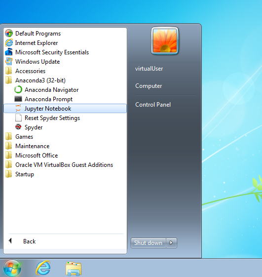

**Important**: The notebooks are being added throughout the fall semester of 2019!

# An Introduction to Python and Programming

The purpose of this repository is to serve as an interactive "book" for a
thorough introductory course on programming in the
**[Python](https://www.python.org/)** language.

The course's **main goal** is to **prepare** the student for **further
studies** in the "field" of **data science**.

The "chapters" are written in [Jupyter notebooks](https://jupyter-notebook.readthedocs.io/en/stable/)
which are a de-facto standard for exchanging code and results among data
science professionals and researchers.
As such they can be viewed in a plain web browser:

- [00 - Start up](https://nbviewer.jupyter.org/github/webartifex/intro-to-python/blob/master/00_start_up.ipynb)
- [01 - Elements of a Program](https://nbviewer.jupyter.org/github/webartifex/intro-to-python/blob/master/01_elements.ipynb)
- [02 - Functions & Modularization](https://nbviewer.jupyter.org/github/webartifex/intro-to-python/blob/master/02_functions.ipynb)
- [03 - Conditionals & Exceptions](https://nbviewer.jupyter.org/github/webartifex/intro-to-python/blob/master/03_conditionals.ipynb)

However, it is recommended that students **install Python and Jupyter
locally** and run the code in the notebooks on their own.
This way, the student can play with the code and learn more efficiently.
Precise **installation instructions** are either in the [00th notebook](
https://nbviewer.jupyter.org/github/webartifex/intro-to-python/blob/master/00_start_up.ipynb)
or further below.

Feedback is encouraged and will be incorporated.
Open an issue in the [issues tracker](https://github.com/webartifex/intro-to-python/issues)
or initiate a [pull request](https://help.github.com/en/articles/about-pull-requests)
if you are familiar with the concept.

## Prerequisites

To be suitable for *total beginners*, there are *no* formal prerequisites.
It is only expected that the student has:

- a *solid* understanding of the **English language**,
- knowledge of **basic mathematics** from high school,
- the ability to **think conceptually** and **reason logically**, and
- the willingness to **invest 2-4 hours a day for a month**.

## Installation

To follow this course, a working installation of **Python 3.6** or higher is
expected.

A popular and beginner friendly way is to install the [Anaconda Distribution](
https://www.anaconda.com/distribution/) that not only ships Python but comes
pre-packaged with a lot of third-party libraries from the so-called
"scientific stack".
Just go to the [download](https://www.anaconda.com/distribution/#download-section)
section and install the latest version (i.e., *2019-07* with Python 3.7 at the
time of this writing) for your operating system.

Then, among others, you will find an entry "Jupyter Notebook" in your start
menu like below.
Click on it and a new tab in your web browser will open where you can switch
between folders as you could in your computer's default file browser.

To download the course's materials as a ZIP file, click on the green "Clone or
download" button on the top right on this website.
Then, unpack the ZIP file into a folder of your choosing (ideally somewhere
within your personal user folder so that the files show up right away).

### Alternative Installation

Python can also be installed in a "pure" way as obtained from its core
development team (i.e., without any third-party packages installed).
However, this is somewhat too "advanced" for a beginner as it involves working
with a terminal emulator, which looks similar to the picture below and is
used without a mouse by typing commands into it.

Assuming that you already have a working version of Python 3.6 or higher
installed (cf., the official [download page](https://www.python.org/downloads/)),
the following summarizes the commands to be typed into a terminal emulator to
get the course materials up and running on a local machine without Anaconda.
You are then responsible for understanding the concepts behind them.

First, the [git](https://git-scm.com/) command line tool is a more professional
way of "cloning" the course materials as compared to downloading them in a ZIP
file.

- `git clone https://github.com/webartifex/intro-to-python.git`

This creates a new folder *intro-to-python* with all the materials of this
repository in it.

Inside this folder, it is recommended to create a so-called **virtual
environment** with Python's [venv](https://docs.python.org/3/library/venv.html)
module.
This must only be done the first time.
A virtual environment is a way of *isolating* the third-party packages
installed by different projects, which is considered a best practice.

- `python -m venv venv`

The second *venv* is the environment's name and by convention often chosen to
be *venv*.
However, it could be another name as well.

From then on, each time you want to resume work, go back into the
*intro-to-python* folder inside your terminal and "activate" the virtual
environment (*venv* is the name chosen before).

- `source venv/bin/activate`

This may change how the terminal's [command prompt](https://en.wikipedia.org/wiki/Command-line_interface#Command_prompt)
looks.

[poetry](https://poetry.eustace.io/docs/) and [virtualenvwrapper](https://virtualenvwrapper.readthedocs.io/en/latest/)
are popular tools to automate the described management of virtual environments.

After activation for the first time, you must install the project's
**dependencies** (= the third-party packages needed to run the code), most
notably [Jupyter](https://pypi.org/project/jupyter/) in this project (the
"python -m" is often left out; if you have poetry installed, you may just
type `poetry install` instead).

- `python -m pip install -r requirements.txt`

With everything installed, you can now do the equivalent of clicking the
"Jupyter Notebook" entry in your start menu.

- `jupyter notebook`

This opens a new tab in your web browser just as above.

## About the Author

Alexander Hess is a PhD student at the Chair of Logistics Management at the
[WHU - Otto Beisheim School of Management](https://www.whu.edu) where he
conducts research on urban delivery platforms and teaches an introductory
course on Python (cf., [course listing](https://vlv.whu.edu/campus/all/event.asp?objgguid=0xE57C2715B01B441AAFD3E79AA05CACCF&from=vvz&gguid=0x6A2B0ED5B2B949E69957A2099E7DE2F1&mode=own&tguid=0x3980A9BBC3BF4A638E977F2DC163F44B&lang=en)).

Connect him on [LinkedIn](https://www.linkedin.com/in/webartifex).
